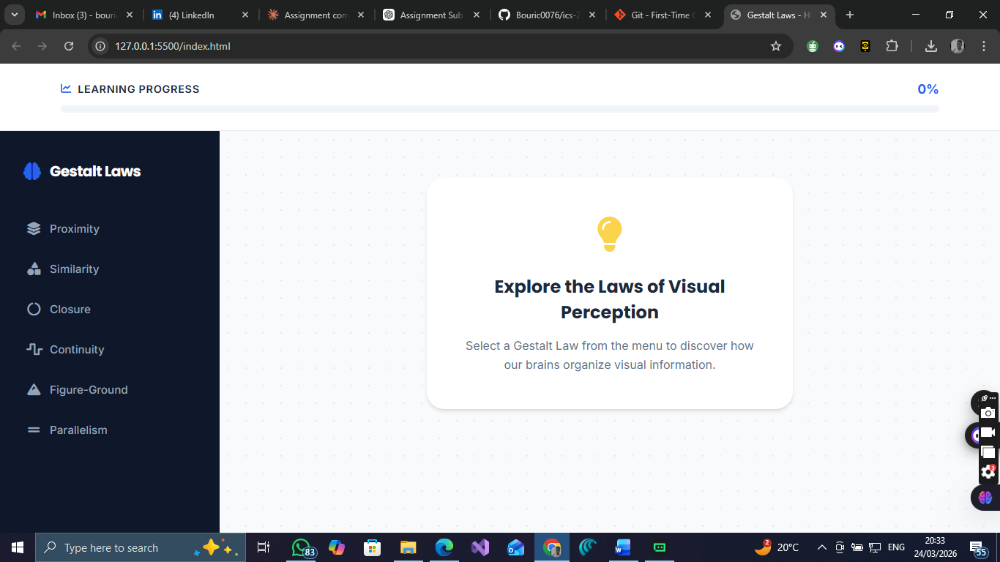

# ICS 2402 HCI: Gestalt Laws & Direct Manipulation

This repository contains the implementation of a web-based interface exploring Gestalt Laws of Visual Perception. The project focuses on the core characteristics of **Direct Manipulation**, including incremental action and rapid feedback.

## Project Overview

The application allows users to explore six fundamental Gestalt laws:
- Proximity
- Similarity
- Closure
- Continuity
- Figure-Ground
- Parallelism

### Key Features
- **Incremental Action**: A dynamic progress bar tracks the learning journey as users explore each law.
- **Rapid Feedback**: Immediate visual updates (highlighting, content display, and progress increments) upon user interaction.
- **Visual Illustrations**: Custom SVG/CSS examples for each principle to enhance understanding.
- **Formal UI**: A clean, professional interface designed for educational assessment.

## Snapshot

## Technical Stack
- HTML5
- CSS3 (Custom variables, animations, and grid layouts)
- JavaScript (Vanilla JS for DOM manipulation and state management)
- Font Awesome for professional iconography

## How to Run
Simply open `index.html` in any modern web browser.
